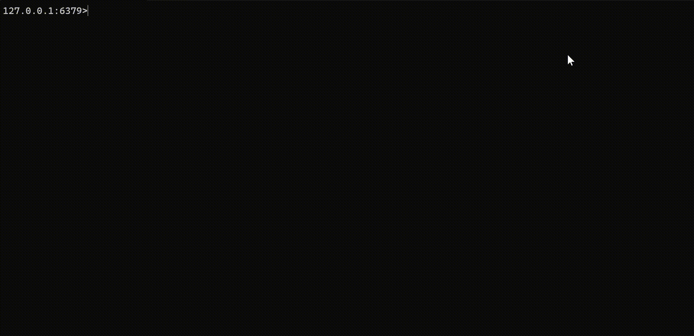

# Radis CLI

A simple implementation of Redis CLI in .NET

## Demo



## Features

- Basic Redis commands (i.e. GET, SET, DEL, LPUSH, LPOP, RPUSH, LPOP).
- Connect to custom server IP and port during start up.
- `help` is included for the list of supported commands.

## Run Locally

The current version only supports Windows environment.
As a prerequisite, it is also required to have .NET 8.0 (or compatible versions) installed. 

Clone the project

```bash
git clone git@github.com:tlphat/radis-cli.git
```

Navigate to the directory

```bash
cd radis-cli
```

Build the executable file

```bash
dotnet build --source ./RadisCli --configuration Release
```

Navigate to executable file's directory (where the config file is located)

```bash
cd ./RadisCli/bin/Release/net8.0
```

Run the executable file

```
./RadisCli.exe -h <host> -p <port>
```
